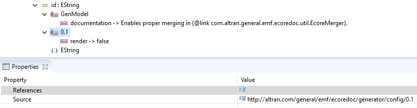

// White Up-Pointing Triangle
:wupt: &#9651;

:inherited: {wupt}{nbsp}

:toc:
:toclevels: 5
:miscellaneous.tabsize: 2
:tabsize: 2
:icons: font
:sectnum: 
:sectnums: 
:experimental:
:commandkey: &#8984;
:m1keys: Ctrl]/kbd:[{commandkey}
:source-highlighter: pygments
:prewrap!:
:table-caption!:
:figure-caption!:
:docinfo2:

= EcoreDoc User Guide
Niko Stotz <niko.stotz@altran.com>
v0.7.0-SNAPSHOT

Generates https://asciidoctor.org/[AsciiDoctor] files to document Ecore metamodels, similar to https://docs.oracle.com/javase/9/javadoc/javadoc.htm[JavaDoc].
AsciiDoctor can be rendered as HTML, PDF, or Eclipse Help.
EcoreDoc can be used as https://maven.apache.org/[Maven] Plugin, standalone command-line tool, or as Java API.

== Overview

EcoreDoc's <<java-api>> works on a list of ``EClassifier``s.
<<maven-tool>> and <<standalone-tool>> take all ``EClassifier``s from one or more `{asterisk}.ecore` or `{asterisk}.xcore` files.

EcoreDoc creates one output document containing all passed ``EClassifier``s.
They are grouped by containing `EPackage`.
The output document contains documentation, all properties of supported elements, and cross-references to all usages of each element.

EcoreDoc currently supports the following elements:

* `EPackage`
* `EDataType`
* `EEnum`
* `EEnumLiteral`
* `EClass`
* `EAttribute`
* `EReference`

EcoreDoc is highly configurable via the <<generator-config>>.

The homepage and repository of EcoreDoc can be found at https://gitlab.manatree.io/MDEAssets/EcoreDoc.
Please use the issue tracker at this site for any feature requests or bugs.

[[java-api]]
== Java API

The Java API is available as Maven artifact `com.altran.general.emf.ecoredoc:com.altran.general.emf.ecoredoc.generator` or OSGi bundle `com.altran.general.emf.ecoredoc.generator.ebr`. +
The <<generator-config>> is contained in Maven artifact `com.altran.general.emf.ecoredoc:com.altran.general.emf.ecoredoc.generator.config` or OSGi bundle `com.altran.general.emf.ecoredoc.generator.config.ebr`.

The main interface is `com.altran.general.emf.ecoredoc.generator.EcoreDocGenerator`.
The constructor takes the list of ``EClassifier``s to generate documentation for.

The `getConfig()` method returns a fully initialized <<config-EcoreDocGeneratorConfig, `com.altran.general.emf.ecoredoc.generator.config.EcoreDocGeneratorConfig`>> that can be changed to adjust the <<generator-config>>.

The `generate()` method returns a `CharSequence` containing the complete AsciiDoctor output document.

[[maven-tool]]
== Maven Plugin

The Maven Plugin is available as Maven artifact `com.altran.general.emf.ecoredoc:ecoredoc-maven-plugin`.

It supports the following configuration settings:

inputFiles (*required*)::
The list of Ecore metamodel files to create documentation for.

[[option-outputFile]]
outputFile (*required*)::
The output file to write the generated AsciiDoctor document to. +
By convention, the file extension is `.adoc`.
+
CAUTION: If the file exists, it will be overwritten and a warning is emitted.

[[option-resolve]]
resolve (default: false)::
Whether EcoreDoc should explicitly try to resolve all references in the _inputFiles_.
Might be necessary for highly interconnected metamodels.

config (default: unchanged default config)::
Customized <<generator-config>>.
+
The _config_ contents stricly follow the structure and naming relative to <<config-EcoreDocGeneratorConfig>>, easiest explained with an example.
+
Assume the _inputFiles_ contain two ``EPackage``s, namely `EPackage1` and `EPackage2`. +
`EPackage1` contains, among others, two ``EClass``es, named `MyEClass` and `Class3`.
The latter one contains, among others, the `EAttribute` named `specialNumber`. +
`EPackage1` also contains an `EEnum` named `Enum1`.
+
.pom.xml
[source,xml]
----
<?xml version="1.0" encoding="UTF-8"?>
<project xmlns="http://maven.apache.org/POM/4.0.0"
	xmlns:xsi="http://www.w3.org/2001/XMLSchema-instance"
	xsi:schemaLocation="http://maven.apache.org/POM/4.0.0 http://maven.apache.org/xsd/maven-4.0.0.xsd">
	<modelVersion>4.0.0</modelVersion>

	<artifactId>my-artifact-id</artifactId>

	<dependencies>
		<dependency>
			<groupId>com.altran.general.emf.ecoredoc</groupId>
			<artifactId>ecoredoc-maven-plugin</artifactId>
		</dependency>
	</dependencies>

	<build>
		<plugins>
			<plugin>
				<groupId>com.altran.general.emf.ecoredoc</groupId>
				<artifactId>ecoredoc-maven-plugin</artifactId>

				<configuration>
					<resolve>true</resolve>

					<config>
						<renderDefaults>false</renderDefaults>
						<documentTitle>This is the title of my document</documentTitle>
						<ePackages>
							<ePackage>
								<targetEPackage>EPackage1</targetEPackage>
								<eClasses>
									<eClass>
										<targetEClass>MyEClass</targetEClass>
										<repeatInherited>false</repeatInherited>
									</eClass>
									<eClass>
										<targetEClass>Class3</targetEClass>
										<eAttributes>
											<eAttribute>
												<targetEAttribute>specialNumber</targetEAttribute>
												<render>false</render>
											</eAttribute>
										</eAttributes>
									</eClass>
								</eClasses>
								<eEnums>
									<eEnum>
										<targetEEnum>Enum1</targetEEnum>
										<renderDefaults>true</renderDefaults>
									</eEnum>
								</eEnums>
							</ePackage>
							<ePackage>
								<targetEPackage>EPackage2</targetEPackage>
								<renderDefaults>true</renderDefaults>
							</ePackage>
						</ePackages>
					</config>
					<inputFiles>
						<inputFile>EPackage1.ecore</inputFile>
						<inputFile>EPackage2.ecore</inputFile>
					</inputFiles>
					<outputFile>output.adoc</outputFile>
				</configuration>
			</plugin>
		</plugins>
	</build>
</project>
----
+
This example sets the following configuration:
+
* <<config-IDefaultValueConfig-renderDefaults, renderDefaults>> for all contents: `true`
* <<config-EcoreDocGeneratorConfig-documentTitle, documentTitle>>: `This is the title of my document`
* <<config-IEClassConfig-repeatInherited, repeatInherited>> for _MyEClass_: `false`
* <<config-IENamedElementConfig-render, render>> for _specialNumber_: `false`
* <<config-IDefaultValueConfig-renderDefaults, renderDefaults>> for _Enum1_: `true`
* <<config-IDefaultValueConfig-renderDefaults, renderDefaults>> for _EPackage2_: `true`

[[standalone-tool]]
== Standalone Command-Line Tool

The standalone command-line tool is available as Maven artifact `com.altran.general.emf.ecoredoc:com.altran.general.emf.ecoredoc.standalone`.

Use the following command to invoke.
Please replace `${ecoredoc-version}` with your version of EcoreDoc:

[source,bash]
----
java -jar com.altran.general.emf.ecoredoc.standalone-${ecoredoc-version}-jar-with-dependencies.jar <options>
----

If invoked without options, it will print the following help:

[source,subs="normal"]
----
Generates reference documentation for ecore models. 
 
The output is inspired by JavaDoc and formatted in AsciiDoctor format. 
AsciiDoctor can easily be rendered to HTML, PDF, or Eclipse help. 
 
 
Usage: 
 
EcoreDocGenerator [parameters] [List of ecore files to generate] 
 
If unspecified, the output file name will be "<firstEcoreFile.ecore>.adoc"
 
 
Parameters: 
 
  -r, 
  --<<option-resolve, resolve>>: Resolve external references 
   
  -o <outputFile>, 
  --<<option-outputFile, output>> <outputFile>: Specify output file name. 
   
  --<<config-EcoreDocGeneratorConfig-documentTitle, documentTitle>> <title>: Set title of output document 
   
  --<<config-IEPackageConfig-positionEDataTypes, positionEDataTypes>> <pos>: Set rendering position of all EDataTypes within EPackage 
   
  --<<config-IEPackageConfig-positionEEnums, positionEEnums>> <pos>:     Set rendering position of all EEnums within EPackage 
   
  --<<config-IEPackageConfig-positionEClasses, positionEClasses>> <pos>:   Set rendering position of all EClasses within EPackage 
   
  [\+|-]<<config-IDefaultValueConfig-renderDefaults, defaults>>:   [Enable|disable] rendering of default values 
   
  [+|-]<<config-IEStructuralFeatureConfig-renderBounds, bounds>>:     [Enable|disable] rendering of multiplicity bounds
                                    (overwrites defaults parameter)

   
  [\+|-]<<config-IEClassConfig-repeatInherited, inherited>>:  [Enable|disable] repetition of inherited features 
   
  [+|-]<<config-IEClassifierConfig-renderUseCases, useCases>>:   [Enable|disable] rendering of use cases
                                    (references to other usages of this element)

   
  [\+|-]<<config-IEClassConfig-renderSubTypes, subTypes>>:   [Enable|disable] rendering of sub-types 
   
  [+|-]<<config-IEClassConfig-renderSuperTypes, superTypes>>: [Enable|disable] rendering of super-types 
 
 
Examples: 
 
  EcoreDocGenerator my.ecore 
  Generates the documentation of my.ecore into my.ecore.adoc 
  
  
  EcoreDocGenerator some/path/to/my.ecore other.ecore 
  Generates the documentation of some/path/to/my.ecore and other.ecore
  into some/path/to/my.ecore.adoc

   
  EcoreDocGenerator -r my.ecore 
  Tries to resolve all external references in my.ecore and 
  generates the documentation of my.ecore and referenced models into my.ecore.adoc

   
  EcoreDocGenerator -defaults +bounds my.ecore 
  Generates the documentation of my.ecore and referenced models into my.ecore.adoc 
  without rendering default values, but still rendering multiplicity bounds

   
  EcoreDocGenerator --positionEClasses 1 --positionEEnums 2 --positionEDataTypes 3 my.ecore 
  Generates the documentation of my.ecore and referenced models into my.ecore.adoc 
  with all EClasses first, then all EEnums, and finally all EDataTypes

   
  EcoreDocGenerator -o output.adoc my.ecore other.ecore 
  Generates the documentation of my.ecore and other.ecore into output.adoc
----

[[ecoredoc-annotation]]
== EcoreDoc Metamodel Annotation
Any of the <<generator-config>> options can be used as Ecore Annotation.
These options will be used by default; any external options take precedence over annotation options.

EcoreDoc will throw an `IllegalArgumentException` if an EcoreDoc annotation contains an illegal value.

=== Ecore Annotation
Create an `EAnnotation` on the annotated element with source `\http://altran.com/general/emf/ecoredoc/generator/config/0.1`.
Within this annotation, create one key/value pair for each option.

CAUTION: The source identifier might change in the future!
However, it should be possible to maintain backwards compability.

.Example Ecore annotation on EAttribute *id* (sets <<config-IENamedElementConfig-render, render>> for *id* to `false`) 

=== Xcore Annotation
First, register the annotation.

.EcoreDoc annotation registration
----
annotation "http://altran.com/general/emf/ecoredoc/generator/config/0.1" as EcoreDoc
----

Afterwards, we can use the annotation as usual.

.Example Xcore annotation on EAttribute *name* (sets <<config-IENamedElementConfig-render, render>> for *name* to `false`) 
----
	@EcoreDoc(
		render="false"
	)
	String name
----

[[generator-config]]
== Generator Configuration

The generator configuration is an Ecore metamodel, so we obviously use EcoreDoc to create the documentation listed below.

The most important parts are:

* <<config-EcoreDocGeneratorConfig>> as model root, also describing the customization hierarchy
* <<config-IENamedElementConfig>>, implemented by all elements
* <<config-IDefaultValueConfig>>, implemented by all elements except <<config-EEnumLiteralConfig>>
* <<config-IEClassifierConfig>>
* <<config-IEClassConfig>>
* <<config-IEPackageConfig>>
* <<config-IEStructuralFeatureConfig>>

.Generator Configuration Class Diagram
:generatorConfigImagePath: ../code/com.altran.general.emf.ecoredoc.generator.config/model/EcoreDoc Generator Config.svg
image::{generatorConfigImagePath}[link="{generatorConfigImagePath}"]

include::../code/com.altran.general.emf.ecoredoc.maven/src/test/resources/testGeneratorConfig/expected.adoc[leveloffset=-1,lines=22..-1]

== Versions

This asset in version {revnumber} was developed using the following components and versions.

[horizontal]
Eclipse:: 4.7.3a (Oxygen 3a)
Google Guava:: 19.0
Apache Commons Lang3:: 3.4
Apache Commons IO:: 2.2
Apache Maven:: 3.3.9
Eclipse Ecore:: 2.12.0
Eclipse Xcore:: 1.3.1
Eclipse Tycho:: 1.2.0

== Known Issues

* If HTML is used in Ecore documentation, the PDF rendering can be faulty (https://gitlab.manatree.io/MDEAssets/EcoreDoc/issues/12[Issue #12])
* ``EOperation``s, ``EParameter``s, ``EAnnotation``s are missing from the documentation (https://gitlab.manatree.io/MDEAssets/EcoreDoc/issues/13[Issue #13], https://gitlab.manatree.io/MDEAssets/EcoreDoc/issues/15[Issue #15])
